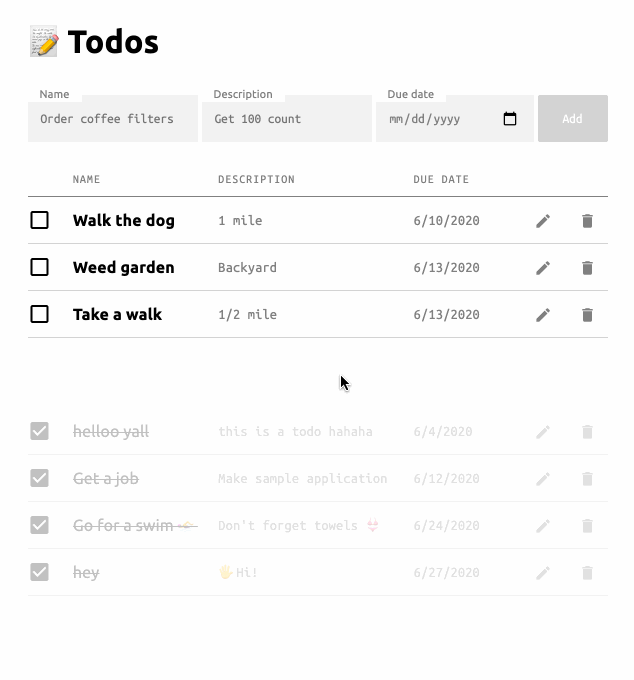
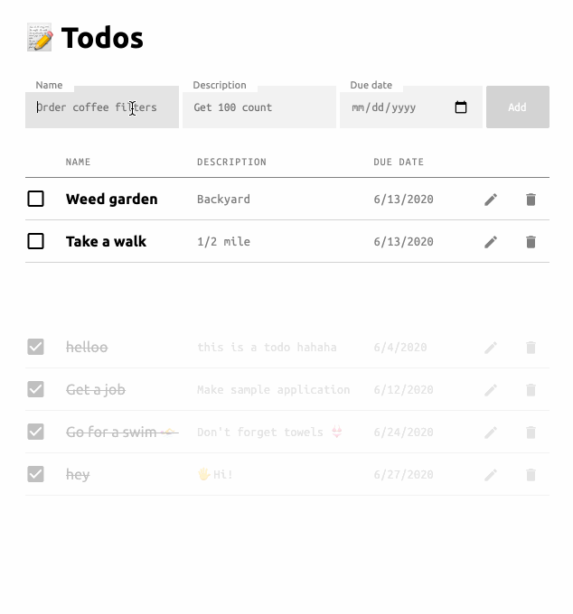

# MERN TODO demo app
### An example todo app built with Mongodb, Express, React, Node
See [demo](https://mrjasonweaver.github.io/mern-todo-demo/)

### Check or delete a todo

### Add or edit a todo
